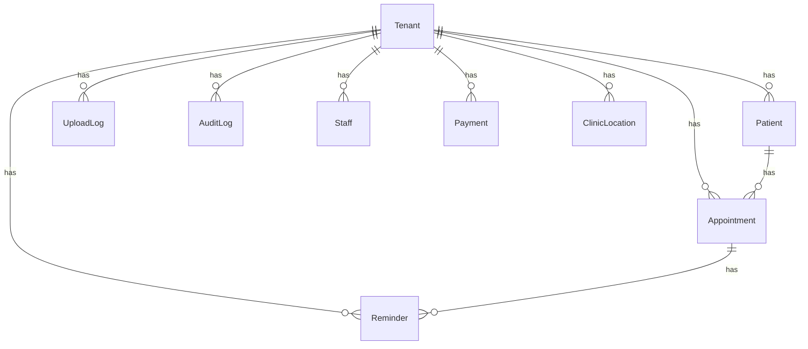
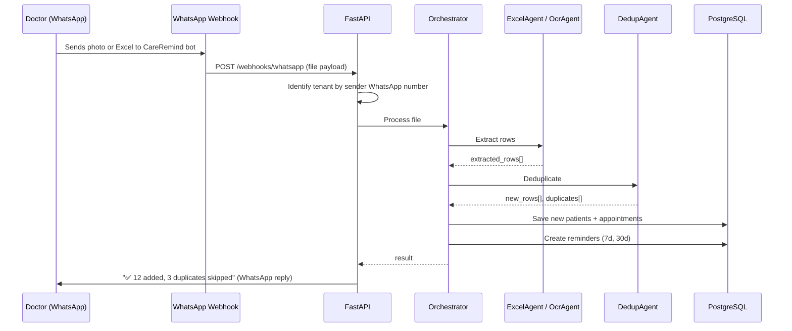
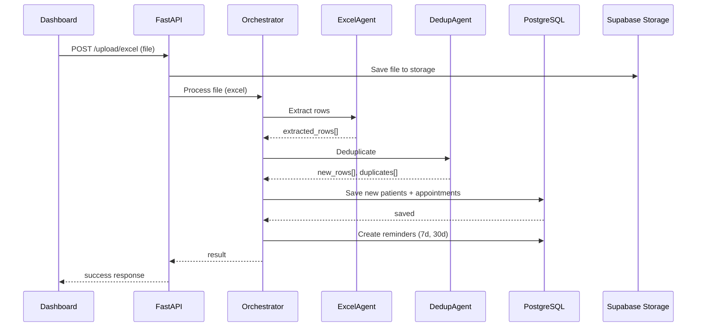
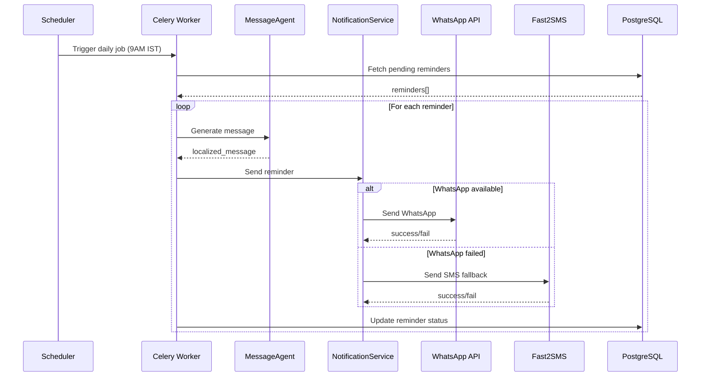
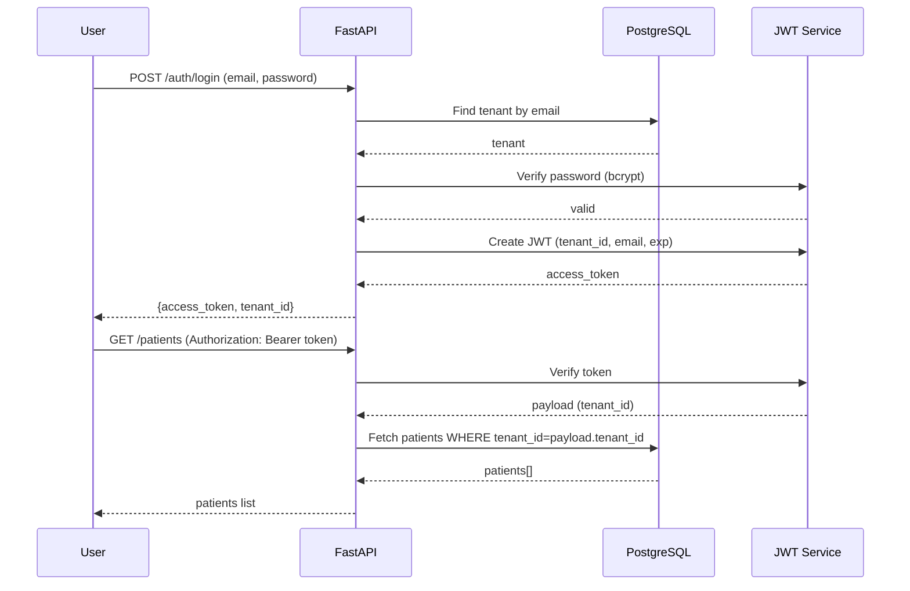

# Low-Level Design

## Database Schema

### Entity Relationship



### Tables

| Table | Purpose | Key Constraints |
|-------|---------|-----------------|
| `tenants` | Doctor accounts | email UNIQUE |
| `clinic_locations` | Doctor clinic addresses | tenant_id FK, multiple per tenant |
| `patients` | Patient records | tenant_id FK, phone_encrypted UNIQUE per tenant |
| `appointments` | Visit records | tenant_id FK, patient_id FK |
| `reminders` | Scheduled notifications | tenant_id FK, appointment_id FK |
| `upload_logs` | Upload history | tenant_id FK |
| `audit_logs` | Activity tracking | tenant_id FK |
| `staff` | Staff members | tenant_id FK |
| `payments` | Payment records | tenant_id FK |

### ClinicLocation Schema

```sql
CREATE TABLE clinic_locations (
    id           VARCHAR PRIMARY KEY,
    tenant_id    VARCHAR NOT NULL REFERENCES tenants(id) ON DELETE CASCADE,
    clinic_name  VARCHAR NOT NULL,
    address_line VARCHAR NOT NULL,
    city         VARCHAR NOT NULL,
    pincode      VARCHAR(6) NOT NULL,
    is_active    BOOLEAN DEFAULT TRUE,
    created_at   TIMESTAMPTZ DEFAULT NOW()
);
-- One doctor -> many clinic locations
-- Managed by doctor from dashboard (add/delete/update)
-- Patient selects clinic during V2 booking
```

---

## Sequence Diagrams

### Upload Flow — WhatsApp Bot (Primary, Daily)



### Upload Flow — Dashboard (Secondary/Optional)



### Reminder Delivery Flow



### Auth Flow



---

## Edge Cases

### Upload
| Scenario | Handling |
|----------|----------|
| Empty Excel | Return 400, "No data found in file" |
| Invalid phone format | Skip row, add to errors list |
| Duplicate phone | Skip row, mark as duplicate |
| Very large file (>10MB) | Return 400, "File too large" |
| Wrong file type | Return 400, "Only .xlsx accepted" |
| OCR fails | Mark as failed, log error |

### Reminders
| Scenario | Handling |
|----------|----------|
| Patient opted out | Skip, mark as Optout |
| WhatsApp not on phone | Fallback to SMS |
| Network failure | Retry up to 2 times |
| Phone invalid | Mark as Failed, log error |
| Duplicate reminder | Prevented by unique constraint |

### Auth
| Scenario | Handling |
|----------|----------|
| Invalid credentials | 401, "Invalid email or password" |
| Expired token | 401, "Token expired" |
| Inactive account | 401, "Account deactivated" |
| Missing token | 403, "Authorization required" |

---

## Error Handling

### HTTP Status Codes

| Code | Usage |
|------|-------|
| 200 | Success |
| 201 | Created |
| 400 | Bad Request (validation) |
| 401 | Unauthorized (auth failure) |
| 403 | Forbidden (no permission) |
| 404 | Not Found |
| 422 | Unprocessable Entity (Pydantic) |
| 429 | Rate Limited |
| 500 | Internal Server Error |

### Error Response Format

```json
{
  "detail": "Human-readable error message"
}
```

### Logging

- All errors logged with traceback
- Production: hide details, show generic message
- Development: show full error for debugging

---

## Security

### Encryption
- Patient phone numbers: AES-256 (Fernet)
- Field-level, not column-level

### Authentication
- JWT with 24h expiry
- Bearer token in Authorization header

### Authorization
- Tenant ID in JWT payload
- All queries filter by tenant_id
- IDOR protection on single-resource endpoints

---

## API Patterns

### Pagination
```python
GET /patients?page=1&per_page=20
```

Response:
```json
{
  "patients": [...],
  "total": 150,
  "page": 1,
  "per_page": 20
}
```

### Filtering
```python
GET /reminders?status=Pending
GET /audit?resource=patient&resource_id=abc
```

### IDOR Protection
Every GET/PATCH/DELETE on single resource:
```python
# Verify resource belongs to requesting tenant
if str(resource.tenant_id) != str(tenant.id):
    raise ForbiddenException()
```
